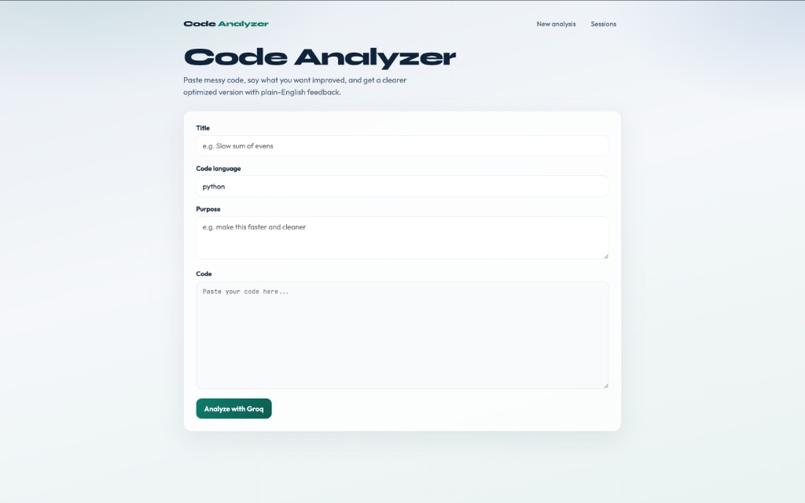
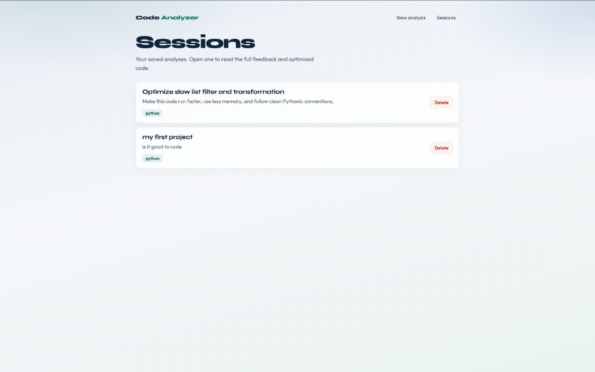
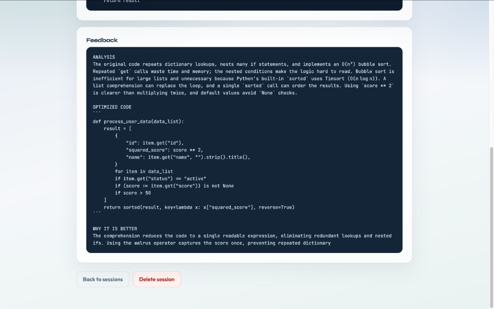
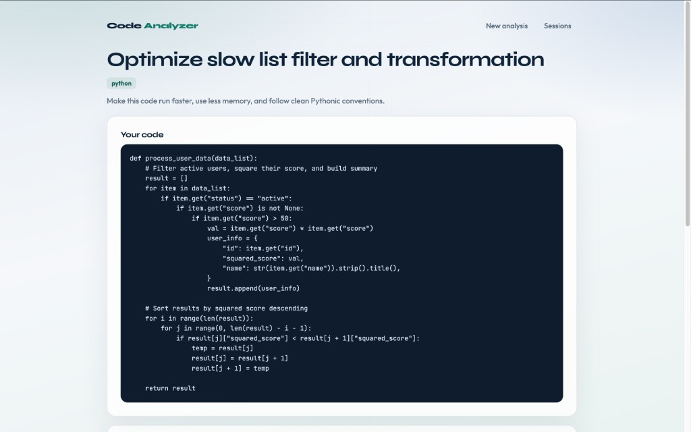

# Welcome to Code Analyzer! ⚡️

**AI-powered code review & optimization** — paste your code, state your goal, and get clear analysis plus an improved version.

### Live Demo Photos 📸

| Home / New analysis | Sessions list |
| --- | --- |
|  |  |

| Session detail (feedback) | Session detail (optimized code) |
| --- | --- |
|  |  |

> Drop your 3–4 screenshots into `docs/screenshots/` using the filenames above (or rename the links to match your files).

---

## Inspiration 💡

I built **Code Analyzer** because beginners often paste messy code and get either nothing useful or a wall of jargon. I wanted a simple web app where you can:

- submit real code with a clear **purpose**
- get **plain-English** feedback
- see an **optimized version**
- keep a **history** of past sessions and reopen them anytime

The goal was a clean Django workflow: form → AI service → database → readable detail pages — not a giant single-page dump of text.

---

## What it does 🎯

Code Analyzer is a Django web app that helps you improve code with AI.

It lets users:

- 🧠 Submit a **title**, **language**, **purpose**, and **code**
- ⚙️ Send the request to **Groq** for analysis and optimization
- 💬 Read structured feedback: **ANALYSIS**, **OPTIMIZED CODE**, **WHY IT IS BETTER**
- 📂 Browse all past work on a **Sessions** page
- 🔍 Open a **detail page** for one session
- 🗑️ Delete sessions from the list or detail view

Under the hood, the AI call lives in `services.py`, so views stay focused on HTTP, saving, and redirects.

---

## Core Features ⚒️

- 🏠 Clean **home form** for new analyses
- 📜 **Sessions history** with title, purpose, and language
- 🧾 **Detail view** for full code + AI feedback
- 🗑️ **Delete** from list (right side) and detail page
- 🤖 **Groq** integration (`openai/gpt-oss-20b`)
- 🧩 Prompt rules for short, readable answers (2–4 sentences, more if needed)
- 🎨 Shared UI via Django template inheritance (`base.html`)
- 🔒 API key loaded from environment (`GROQ_API_KEY`)

---

## How I built it 🏗️

- **Django** — views, URLs, templates, CSRF forms, SQLite
- **Groq Python SDK** — chat completions for code optimization
- **HTML + CSS** — custom UI (Syne / Outfit / JetBrains Mono)
- **Separation of concerns** — `services.py` for AI, `views.py` for app flow

Flow:

1. User submits the form on `/`
2. View calls `analyze_code_with_genai(...)`
3. Result is saved in `CodeSubmission`
4. User is redirected to `/sessions/<id>/`
5. History stays available at `/sessions/`

---

## Challenges I ran into ⚠️

- Gemini free-tier / model availability issues → switched to **Groq**
- Groq model IDs changing (`llama-3.3-70b-versatile` deprecated) → updated to a current model
- Keeping AI answers readable (no Markdown/LaTeX walls of text)
- Avoiding a huge single-page feedback dump → separate **list** + **detail** pages
- Accidentally committing `venv/` → fixed with `.gitignore` and a cleanup commit

---

## Accomplishments I'm proud of 🏆

- End-to-end Django + AI app: submit → analyze → save → review → delete
- Clean multi-page UX (home, sessions, detail)
- Practical prompt design for beginners
- Public GitHub repo with only source code (no `venv` / local DB)

---

## What’s next 🚀

- Move `SECRET_KEY` / API keys fully into `.env`
- User accounts so sessions are private per user
- Streaming AI responses for a faster feel
- Syntax highlighting on the detail page
- Deploy online (Railway / Render / similar)

---

## Tech Stack 💻

| Area | Tech |
| --- | --- |
| Backend | Django |
| AI | Groq (`openai/gpt-oss-20b`) |
| Database | SQLite |
| Frontend | HTML, CSS, Django templates |
| Config | Environment variables (`GROQ_API_KEY`) |

---

## Development ⚙️

### 1) Clone the repository

```bash
git clone https://github.com/Asliddin-22/Code-Analyzer.git
cd Code-Analyzer
```

### 2) Create a virtual environment & install dependencies

```bash
python3 -m venv venv
source venv/bin/activate   # Windows: venv\Scripts\activate
pip install -r requirements.txt
```

### 3) Set your Groq API key

```bash
export GROQ_API_KEY="your_groq_api_key"
```

Get a key at: [https://console.groq.com/keys](https://console.groq.com/keys)

### 4) Run migrations and start the server

```bash
python manage.py migrate
python manage.py runserver
```

### 5) Open in your browser

👉 http://127.0.0.1:8000

---

## Project structure 📁

```text
Code Analyzer/
├── analyzer/
│   ├── models.py
│   ├── views.py
│   ├── services.py
│   └── templates/
├── config/
├── docs/screenshots/          ← put your photos here
├── manage.py
├── requirements.txt
└── README.md
```

---

## Screenshots to add 📷

Save these files in `docs/screenshots/`:

1. `01-home.png` — New analysis form  
2. `02-sessions.png` — Sessions list with Delete  
3. `03-detail-feedback.png` — Detail page feedback  
4. `04-detail-code.png` — Optimized code section (optional 4th photo)

Then commit:

```bash
git add docs/screenshots README.md
git commit -m "Add README and screenshots"
git push origin main
```

---

## Contributing 🤝

This project is open for learning and improvements.  
Fork the repo, create a branch, and open a pull request. Thanks!
